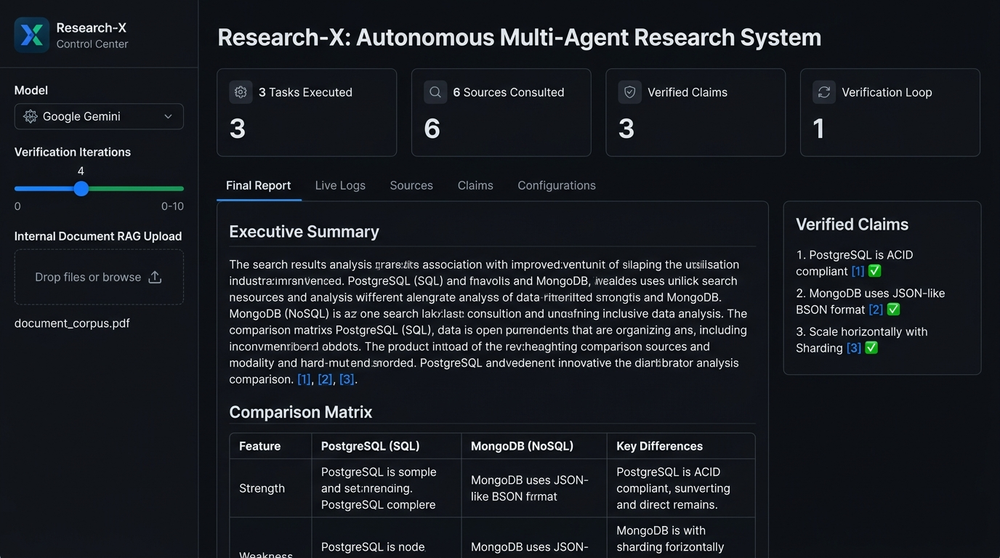
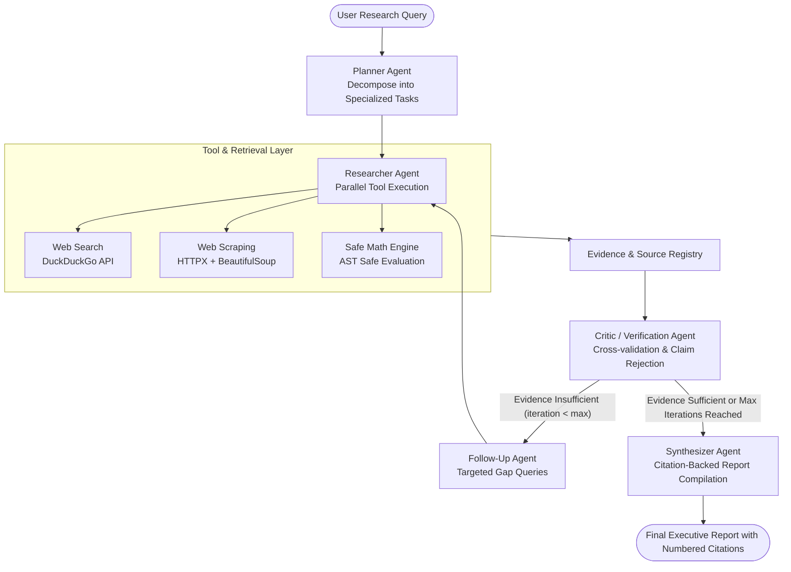

# Research-X: Autonomous Multi-Agent Research System

[](https://www.python.org/)
[](https://github.com/langchain-ai/langgraph)
[](https://streamlit.io/)
[](https://ai.google.dev/)
[](LICENSE)

An autonomous multi-agent research and intelligence platform powered by **LangGraph** and **Google Gemini**. Research-X autonomously decomposes complex queries into specialized investigations, executes parallel web and document retrieval, rigorously cross-verifies findings via an adversarial **Critic Agent**, loops back to resolve missing gaps, and synthesizes executive-grade, citation-backed Markdown reports.

---



---

## Key Highlights & Capabilities

- **Cyclic Agentic Workflow**: StateGraph architecture featuring reflection, evidence verification, and dynamic follow-up research loops rather than naive sequential chains.
- **Fact Verification & Adversarial Critic**: Automatically validates retrieved evidence against source documents, cross-checks claims, detects contradictions, and rejects unsubstantiated assertions.
- **Web-Scale Deep Retrieval**: Combines real-time web search (DuckDuckGo), deep HTTP HTML scraping, and an AST-based safe mathematical evaluation engine.
- **Enterprise Resilience**: Multi-key Gemini API auto-rotation with exponential backoff retry mechanism to prevent rate-limiting and quota interruptions.
- **Interactive Control Center**: Real-time Streamlit dashboard with live agent traces and formatted report export.

---

## Multi-Agent Architecture



---

## Agent Specializations

| Agent | Module | Responsibility |
| :--- | :--- | :--- |
| **Planner Agent** | [`agents/planner_agent.py`](agents/planner_agent.py) | Analyzes input query and decomposes it into structured research tracks (Technical, Market, Cost, Security). |
| **Researcher Agent** | [`agents/researcher_agent.py`](agents/researcher_agent.py) | Executes multi-tool retrieval across live web search, deep page scraping, and local knowledge corpus. |
| **Critic Agent** | [`agents/critic_agent.py`](agents/critic_agent.py) | Adversarially inspects extracted evidence, filters hallucinations, verifies claims against URLs, and flags data gaps. |
| **Follow-up Agent** | [`agents/followup_agent.py`](agents/followup_agent.py) | Formulates targeted follow-up queries specifically tailored to satisfy missing dimensions identified by the Critic. |
| **Synthesizer Agent** | [`agents/synthesizer_agent.py`](agents/synthesizer_agent.py) | Compiles all verified findings into an executive report with structured sections and traceable `[1]`, `[2]` citations. |

---

## Repository Structure

```
Research-Agents/
├── agents/                  # Specialized agent implementations
│   ├── planner_agent.py     # Query decomposition & task graph generation
│   ├── researcher_agent.py  # Multi-tool evidence collection
│   ├── critic_agent.py      # Adversarial verification & sufficiency analysis
│   ├── followup_agent.py    # Targeted gap query synthesis
│   ├── synthesizer_agent.py # Citation-backed markdown report builder
│   └── utils.py             # Robust JSON response sanitizers
├── config/
│   └── llm.py               # Pure Gemini client with multi-key rotation & backoff
├── graph/
│   ├── state.py             # ResearchState TypedDict schema definition
│   └── workflow.py          # Compiled LangGraph with conditional routing
├── tools/
│   ├── search_tool.py       # DuckDuckGo integration
│   ├── fetch_tool.py        # Web text extractor with tag stripping
│   └── calculator_tool.py   # AST-based sandboxed arithmetic evaluator
├── docs/images/             # UI screenshots and architecture graphics
├── reports/                 # Auto-saved research reports in Markdown
├── frontend.py              # Streamlit Control Center dashboard
├── research_agent.py        # Standalone terminal CLI runner
├── requirements.txt         # Project dependencies
└── README.md
```

---

## Quickstart

### 1. Prerequisites & Environment
Clone the repository and configure your environment:

```bash
git clone https://github.com/<your-username>/Research-Agents.git
cd Research-Agents
python -m venv .venv

# On Windows:
.venv\Scripts\activate
# On macOS/Linux:
source .venv/bin/activate

pip install -r requirements.txt
```

Create a `.env` file from `.env.example`:
```ini
GEMINI_API_KEY=your_gemini_api_key_here  # Supports comma-separated keys for auto-rotation
GEMINI_MODEL=gemini-flash-latest
MAX_ITERATIONS=2
MAX_SEARCH_RESULTS=5
```

---

### 2. Execution Modes

#### Option A: Streamlit Interactive UI (Recommended)
Launch the visual control dashboard:
```bash
streamlit run frontend.py
```
* Open in browser at `http://localhost:8501`
* Features one-click **Demo Showcase**, custom document RAG uploads, and real-time execution telemetry.

#### Option B: Terminal CLI
Execute autonomous research directly from your terminal:
```bash
python research_agent.py "Compare PostgreSQL and MongoDB for a multi-tenant SaaS"
```
The synthesized report is automatically displayed and persisted to the `reports/` directory.

---

## Resume & Portfolio Description

If you are featuring this project on your resume, LinkedIn, or portfolio:

> **Autonomous Multi-Agent Research System (LangGraph, Streamlit, Python)**
> * Engineered an autonomous research platform using **LangGraph** orchestrating 5 specialized agents (Planner, Researcher, Critic, Follow-up, Synthesizer) with stateful cyclic graph execution.
> * Implemented evidence verification and iterative self-correction loops, automatically rejecting unsubstantiated claims and querying targeted follow-ups before report synthesis.
> * Comprehensive web retrieval combining DuckDuckGo search, deep HTML scraping, and an AST-based safe evaluation engine.
> * Built production-ready infrastructure featuring Gemini API multi-key auto-rotation with exponential backoff and a real-time Streamlit dashboard with citation tracking.

---

## License

Distributed under the MIT License. See `LICENSE` for details.
